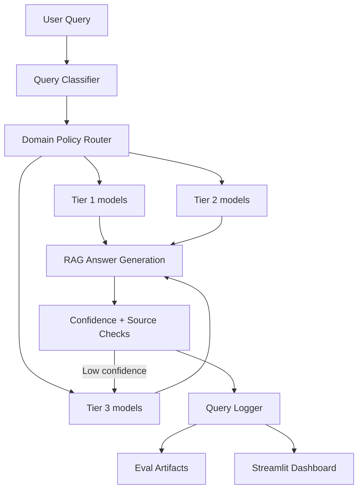

# Complete Project Documentation

## 1. Project Purpose

This project is a cost-aware, quality-controlled Retrieval-Augmented Generation (RAG) system.

Instead of sending every query to the most expensive model, the system:

1. Retrieves relevant context from a local vector database.
2. Classifies the query complexity.
3. Routes to the cheapest likely-capable model tier.
4. Escalates to stronger models only when quality signals are weak.
5. Logs full decision traces for cost, latency, confidence, and auditability.

The result is a production-style LLM routing system optimized for cost-performance tradeoffs.

## 2. Tech Stack

### 2.1 Core Runtime

- Python: application runtime and orchestration.
- argparse: command-line interface.
- dataclasses: typed configuration and response structures.

### 2.2 LLM and Routing Layer

- LiteLLM: provider-agnostic model calling and cost calculation.
  - Used in [src/rag/llm_client.py](src/rag/llm_client.py).
  - Supports OpenAI, Anthropic, Groq, Together, and others via unified API.

### 2.3 RAG Layer

- LangChain ecosystem:
  - langchain, langchain-community: base interfaces and integration utilities.
  - langchain-chroma: vector store adapter for Chroma.
  - langchain-huggingface: embedding wrapper for HuggingFace models.

- ChromaDB:
  - Local persistent vector database under [vectorstore](vectorstore).

- sentence-transformers:
  - Embedding backbone (default: all-MiniLM-L6-v2).

### 2.4 Evaluation and Analytics

- pandas: metric aggregation and CSV handling.
- rapidfuzz: token-based answer similarity scoring.
- plotly + streamlit: interactive dashboard and visual analytics.

### 2.5 Environment and Automation

- python-dotenv: load environment variables from .env.
- PowerShell + batch wrappers:
  - [scripts/run_all.ps1](scripts/run_all.ps1)
  - [scripts/run_all.bat](scripts/run_all.bat)

## 3. High-Level Architecture



## 4. Repository Structure and Responsibilities

- [src/main.py](src/main.py): CLI entrypoint and command orchestration.
- [src/config.py](src/config.py): typed app configuration and environment parsing.
- [src/rag/vector_store.py](src/rag/vector_store.py): corpus loading, chunking, embedding, Chroma ingestion/retrieval.
- [src/rag/llm_client.py](src/rag/llm_client.py): robust JSON LLM calls, model fallback loop, cost extraction.
- [src/router/classifier.py](src/router/classifier.py): query complexity classification.
- [src/router/domain_policy.py](src/router/domain_policy.py): domain-specific routing rules, thresholds, KPI target bands.
- [src/router/model_router.py](src/router/model_router.py): tier model selection, generation, confidence-based escalation.
- [src/router/confidence.py](src/router/confidence.py): confidence heuristics and blending.
- [src/cache/semantic_cache.py](src/cache/semantic_cache.py): embedding-based near-duplicate answer cache.
- [src/pipeline/rag_pipeline.py](src/pipeline/rag_pipeline.py): end-to-end query execution flow.
- [src/evaluation/evaluator.py](src/evaluation/evaluator.py): scenario benchmark runs and summary generation.
- [src/evaluation/threshold_sweep.py](src/evaluation/threshold_sweep.py): threshold policy sweep experiments.
- [src/utils/logger.py](src/utils/logger.py): JSONL logging for all query executions.
- [dashboard/app.py](dashboard/app.py): dashboard UI and KPI visualizations.

## 5. Configuration and Parameter Reference

### 5.1 Environment Variables (.env)

Template file: [.env.example](.env.example)

| Name | Type | Default | Purpose | Where used |
|---|---|---|---|---|
| OPENAI_API_KEY | string | empty | Auth for OpenAI models | LiteLLM provider calls |
| ANTHROPIC_API_KEY | string | empty | Auth for Anthropic models | LiteLLM provider calls |
| GROQ_API_KEY | string | empty | Auth for Groq models | LiteLLM provider calls |
| TOGETHERAI_API_KEY | string | empty | Auth for Together models | LiteLLM provider calls |
| HF_TOKEN | string | empty | Optional HuggingFace auth for better rate limits/download speed | embedding model downloads |
| EMBEDDING_MODEL | string | sentence-transformers/all-MiniLM-L6-v2 | Embedding model identifier | vector store + semantic cache |
| CLASSIFIER_MODEL | string | gpt-4o-mini | Model used for query complexity classification | classifier |
| ROUTER_DOMAIN | string | support | Default domain preset if CLI --domain is omitted | domain policy initialization |
| TIER_1_MODELS | CSV string | gpt-4o-mini,groq/llama-3.1-8b-instant | Low-cost model candidates | model router |
| TIER_2_MODELS | CSV string | gpt-4o,claude-3-5-sonnet-latest | Mid-tier model candidates | model router |
| TIER_3_MODELS | CSV string | o3-mini,gpt-4o | High-quality escalation candidates | model router |
| CONFIDENCE_THRESHOLD | float | 0.72 | Global fallback threshold baseline | config + policy base |
| RETRIEVAL_TOP_K | int | 4 | Number of chunks retrieved per query | retriever |
| CHUNK_SIZE | int | 900 | Maximum chunk length (characters) | ingestion splitter |
| CHUNK_OVERLAP | int | 120 | Overlap between adjacent chunks (characters) | ingestion splitter |
| ENABLE_SEMANTIC_CACHE | bool | true | Enable semantic cache for interactive path | pipeline |
| SEMANTIC_CACHE_SIMILARITY_THRESHOLD | float | 0.9 | Minimum cosine similarity for cache hit | semantic cache lookup |
| SEMANTIC_CACHE_MAX_ENTRIES | int | 1000 | Upper bound cache entries stored | semantic cache storage |
| SEMANTIC_CACHE_MIN_CONFIDENCE | float | 0.65 | Minimum answer confidence required before caching | semantic cache storage |

### 5.2 AppConfig Fields

Defined in [src/config.py](src/config.py) as AppConfig.

Path fields:

- project_root: repository root path.
- corpus_dir: source documents directory.
- vectorstore_dir: persistent Chroma location.
- logs_dir: output log directory.
- eval_set_path: input eval CSV path.
- eval_results_path: per-query eval outputs.
- eval_summary_path: aggregate eval summary JSON.
- threshold_sweep_path: combined sweep CSV.
- threshold_sweep_summary_path: sweep metadata JSON.
- sweep_runs_dir: per-threshold run folders.
- query_log_path: JSONL interaction logs.
- semantic_cache_path: persistent cache JSON file.

Behavior fields:

- embedding_model, classifier_model, default_domain.
- tier_1_models, tier_2_models, tier_3_models.
- confidence_threshold.
- semantic cache controls.
- retrieval_top_k, chunk_size, chunk_overlap.

## 6. Domain Preset Policies

Source: [src/router/domain_policy.py](src/router/domain_policy.py)

Supported domains:

- support
- devdocs
- compliance

### 6.1 Routing Intent Rules

support:

- High-risk keywords force tier_3.
- Simple classification routes to tier_1.
- Complex/ambiguous routes to tier_2.

devdocs:

- Debugging/architecture keywords force tier_3.
- Direct lookup keywords route to tier_1 (unless complex).
- How-to keywords route to tier_2.

compliance:

- Regulatory/high-risk keywords force tier_3.
- Simple lookup routes to tier_2 (more conservative than support).
- Non-simple interpretation routes to tier_3.

### 6.2 Per-Tier Acceptance Thresholds

support thresholds:

- tier_1: 0.78
- tier_2: 0.74
- tier_3: 0.68

devdocs thresholds:

- tier_1: 0.80
- tier_2: 0.76
- tier_3: 0.72

compliance thresholds:

- tier_1: 0.90
- tier_2: 0.84
- tier_3: 0.88

### 6.3 Minimum Source-Count Requirements

- support: tier_1=1, tier_2=1, tier_3=1
- devdocs: tier_1=1, tier_2=1, tier_3=1
- compliance: tier_1=2, tier_2=1, tier_3=2

Escalation can trigger if either confidence is below threshold or source_count is below domain minimum.

### 6.4 Domain KPI Targets

These values are used by dashboard KPI band checks:

support:

- accuracy_min_pct: 88
- cost_savings_min_pct: 35
- tier1_p95_latency_max_ms: 4000
- escalation_rate_max_pct: 45
- cache_hit_rate_min_pct: 5

devdocs:

- accuracy_min_pct: 90
- cost_savings_min_pct: 40
- tier1_p95_latency_max_ms: 4500
- escalation_rate_max_pct: 55
- cache_hit_rate_min_pct: 4

compliance:

- accuracy_min_pct: 94
- cost_savings_min_pct: 15
- tier1_p95_latency_max_ms: 6000
- escalation_rate_max_pct: 80
- cache_hit_rate_min_pct: 0
- multi_source_rate_min_pct: 80

## 7. End-to-End Query Lifecycle

Orchestrated by [src/pipeline/rag_pipeline.py](src/pipeline/rag_pipeline.py).

1. Resolve active domain policy.
2. Optional semantic cache lookup (interactive, non-forced tier).
3. Query complexity classification.
4. Retrieval from Chroma with top-k documents.
5. Context formatting with source tags.
6. Initial tier generation by domain policy.
7. Confidence and source-count acceptance check.
8. Optional escalation to tier_3.
9. Response struct creation.
10. Persistent JSONL logging.

## 8. Detailed Module and Function Reference

### 8.1 CLI Layer ([src/main.py](src/main.py))

Commands:

- ingest: build/update vector store.
- ask: run one query and print answer + metadata.
- eval: run three benchmark scenarios.
- sweep: run threshold sweep experiments.
- run-all: ingest + eval + optional sweep.

CLI parameters:

- ask:
  - --query (required): user question text.
  - --domain (optional): support/devdocs/compliance.

- eval:
  - --use-cache (flag): include semantic cache during benchmark.
  - --domain (optional): select policy preset.

- sweep:
  - --start-threshold (float): range start.
  - --end-threshold (float): range end.
  - --step (float): threshold increment.
  - --domain (optional): preset to evaluate.

- run-all:
  - --start-threshold (float)
  - --end-threshold (float)
  - --step (float)
  - --skip-sweep (flag)
  - --domain (optional)

### 8.2 Ingestion and Retrieval ([src/rag/vector_store.py](src/rag/vector_store.py))

Functions:

- _load_documents(corpus_dir): loads .md/.txt files recursively.
- _split_text(text, chunk_size, chunk_overlap): deterministic character splitter.
  - Validates chunk_size > 0.
  - Validates 0 <= chunk_overlap < chunk_size.
- _split_documents(documents, chunk_size, chunk_overlap): converts full docs into chunked Document objects.
- ingest_corpus(config): embeds chunks and writes to Chroma collection rag_router_docs.
- build_retriever(config): returns retriever with search k = retrieval_top_k.

### 8.3 LLM Invocation Layer ([src/rag/llm_client.py](src/rag/llm_client.py))

Key behavior:

- litellm.drop_params = True to avoid hard failures on unsupported provider params.
- call_json_model(model, messages, fallback_models, temperature, max_tokens):
  - Tries model candidates sequentially.
  - Applies o-series temperature compatibility (o1/o3/o4 => temperature 1.0).
  - Requests JSON response format.
  - Parses JSON robustly from direct output or extracted JSON block.
  - Computes request cost using completion_cost.

Parameters:

- model: primary candidate model.
- messages: chat payload list.
- fallback_models: ordered fallback candidates.
- temperature: creativity control (provider-adjusted for o-series).
- max_tokens: generation upper bound.

Return fields (ModelCallResult):

- model, raw_content, parsed_json, cost_usd, latency_ms.

### 8.4 Query Classification ([src/router/classifier.py](src/router/classifier.py))

Functionality:

- Prompt-based classification via cheap model.
- Labels: simple, complex, ambiguous.
- Heuristic fallback if model/parsing fails.

Heuristic markers:

- complex markers: why, compare, tradeoff, analyze, explain how, best way, strategy.
- ambiguous markers: tell me about, help, what should i do, anything.

Output object (QueryClassification):

- label
- confidence
- rationale

### 8.5 Confidence Scoring ([src/router/confidence.py](src/router/confidence.py))

heuristic_confidence(answer):

- Length-based positive signal.
- Hedging-language penalty using regex patterns.
- Clamped to [0,1].

blend_confidence(self_reported, heuristic):

$$
\text{final\_confidence} = 0.7 \cdot \text{self\_reported} + 0.3 \cdot \text{heuristic}
$$

### 8.6 Domain-Aware Model Router ([src/router/model_router.py](src/router/model_router.py))

Responsibilities:

- Build ordered model attempts per tier.
- Include cross-tier backups for resilience.
- Generate answer JSON with confidence.
- Apply domain policy escalation decision.
- Record route reason.

Key method parameters:

- answer(query, context, classification, forced_tier=None, source_count=1)
  - forced_tier: bypass policy for controlled experiments.
  - source_count: used by policy for source sufficiency checks.

Response fields include:

- tier, model, cost_usd, latency_ms
- model_confidence, heuristic_confidence, final_confidence
- escalated
- domain
- route_reason

### 8.7 Semantic Cache ([src/cache/semantic_cache.py](src/cache/semantic_cache.py))

Behavior:

- Embeds every incoming query.
- Finds nearest cached embedding via cosine similarity.
- Cache hit if similarity >= SEMANTIC_CACHE_SIMILARITY_THRESHOLD.
- Stores only responses with confidence >= SEMANTIC_CACHE_MIN_CONFIDENCE.
- Replaces near-identical entries when similarity >= 0.98.
- Enforces capacity via SEMANTIC_CACHE_MAX_ENTRIES.

Storage schema per entry:

- query
- answer
- model
- tier
- final_confidence
- retrieved_sources
- embedding

### 8.8 Evaluation Engine ([src/evaluation/evaluator.py](src/evaluation/evaluator.py))

Scenarios:

- cheap_only: forced tier_1.
- expensive_only: forced tier_3.
- router: dynamic domain policy.

Answer scoring:

- score_answer(predicted, expected) uses rapidfuzz token_set_ratio.
- correct = 1 if similarity >= 0.74 else 0.

run_evaluation parameters:

- config
- domain
- eval_set_path
- results_output_path
- summary_output_path
- use_cache
- show_progress

Summary metrics per scenario:

- accuracy
- total_cost_usd
- avg_cost_usd
- avg_latency_ms
- tier_1_p95_latency_ms
- escalation_rate
- cache_hit_rate
- multi_source_rate
- router-specific: cost_savings_vs_expensive_pct, accuracy_delta_vs_cheap

### 8.9 Threshold Sweep ([src/evaluation/threshold_sweep.py](src/evaluation/threshold_sweep.py))

Purpose:

- Evaluate policy sensitivity across threshold values.

run_threshold_sweep parameters:

- config
- start, end, step
- domain

Outputs:

- Combined CSV: threshold vs router metrics.
- Summary JSON with best threshold and paths.
- Per-threshold run directories under logs/sweeps.

## 9. Logging and Artifact Schemas

### 9.1 Query Log (JSONL)

Path: logs/query_log.jsonl

Contains RAGResponse fields plus:

- classification
- classification_confidence
- classification_rationale
- scenario
- domain
- timestamp_utc

### 9.2 Eval Results CSV

Path: logs/eval_results.csv

Columns:

- id
- domain
- scenario
- difficulty
- question
- ground_truth
- answer
- similarity
- correct
- classification
- model
- tier
- escalated
- cost_usd
- latency_ms
- final_confidence
- route_reason
- source_count
- cache_hit
- cache_similarity

### 9.3 Eval Summary JSON

Path: logs/eval_summary.json

Structure:

- domain
- scenario aggregates for cheap_only, expensive_only, router

### 9.4 Threshold Sweep CSV and Summary JSON

- logs/threshold_sweep.csv
- logs/threshold_sweep_summary.json

Includes threshold, domain, router accuracy, cost, latency, escalation rate, savings, and selected best threshold metadata.

## 10. Dashboard Reference

Source: [dashboard/app.py](dashboard/app.py)

Panels:

- Top metrics:
  - Router Accuracy
  - Router Total Cost
  - Cost Savings vs Expensive

- Domain KPI Targets:
  - Compares observed values against preset target bands.
  - Status values: pass or watch.

- Semantic Cache Performance:
  - Cache hit rate.

- Cost vs Accuracy by Scenario:
  - Bubble scatter, size by avg latency.

- Per-Query Routing Outcomes:
  - Detailed row-level execution trace.

- Threshold Sweep Frontier:
  - Trend lines across confidence thresholds.

- Live Query Log:
  - Recent execution-level operational history.

## 11. Automation Scripts

### 11.1 run_all.ps1

Path: [scripts/run_all.ps1](scripts/run_all.ps1)

Parameters:

- StartThreshold (double, default 0.60)
- EndThreshold (double, default 0.90)
- Step (double, default 0.05)
- SkipSweep (switch)
- Domain (support/devdocs/compliance, default support)
- PythonExe (default python)

Behavior:

1. Runs run-all command with domain preset.
2. Fails fast on nonzero exit code.
3. Prints next action to launch dashboard.

### 11.2 run_all.bat

Path: [scripts/run_all.bat](scripts/run_all.bat)

Behavior:

- Thin wrapper that invokes run_all.ps1 with forwarded args.

## 12. Operational Playbooks

### 12.1 First-Time Setup

1. Create virtual environment.
2. Install dependencies from [requirements.txt](requirements.txt).
3. Copy [.env.example](.env.example) to .env and fill keys.
4. Run ingestion.
5. Run eval or run-all.
6. Launch Streamlit dashboard.

### 12.2 Common Commands

```bash
python -m src.main ingest
python -m src.main ask --domain support --query "How should I retry charge creation after a timeout?"
python -m src.main eval --domain devdocs
python -m src.main sweep --domain compliance --start-threshold 0.70 --end-threshold 0.90 --step 0.05
python -m src.main run-all --domain support
```

PowerShell:

```powershell
scripts\run_all.ps1 -Domain support
scripts\run_all.ps1 -Domain devdocs -SkipSweep
```

## 13. Troubleshooting Guide

### 13.1 Model Not Found / Provider 404

Symptoms:

- NotFound errors for specific model names.

Actions:

1. Replace unavailable models in TIER_* variables.
2. Keep at least two candidates per tier where possible.
3. Verify account-level model access with provider.

### 13.2 Unsupported Model Params

Symptoms:

- Errors around unsupported temperature for some model families.

Current mitigation:

- O-series models automatically use temperature 1.0.
- Unsupported params are dropped via LiteLLM setting.

### 13.3 Slow First Run

Cause:

- Initial embedding model downloads.

Actions:

1. Set HF_TOKEN in .env.
2. Re-run after first model cache is warm.

### 13.4 No Eval Data in Dashboard

Actions:

1. Run eval or run-all successfully.
2. Confirm artifacts exist in logs directory.
3. Ensure Streamlit points to repository root context.

### 13.5 Empty Retrieval Results

Symptoms:

- Answers mention insufficient context frequently.

Actions:

1. Confirm ingestion ran and indexed chunk count is nonzero.
2. Verify corpus files are .md or .txt under data/corpus.
3. Tune chunk size/overlap and retrieval top-k.

## 14. Security and Governance Notes

1. Keep API keys only in .env and never commit them.
2. Treat logs as potentially sensitive data if real user queries are stored.
3. For compliance domain, keep stricter source-count and confidence rules enabled.
4. Add PII redaction in logger path before production usage.

## 15. Extension Roadmap

High-value next extensions:

1. Domain-specific eval sets:
   - support_eval.csv
   - devdocs_eval.csv
   - compliance_eval.csv
2. LLM-as-judge scoring in addition to fuzzy string similarity.
3. Semantic cache TTL and invalidation strategy.
4. Hybrid retrieval (keyword + dense vectors).
5. Observability export (OpenTelemetry/LangSmith).

## 16. Quick Reference Summary

- Main CLI: [src/main.py](src/main.py)
- Main dashboard: [dashboard/app.py](dashboard/app.py)
- Main config: [src/config.py](src/config.py)
- Domain logic: [src/router/domain_policy.py](src/router/domain_policy.py)
- Routing engine: [src/router/model_router.py](src/router/model_router.py)
- Evaluation engine: [src/evaluation/evaluator.py](src/evaluation/evaluator.py)
- Sweep engine: [src/evaluation/threshold_sweep.py](src/evaluation/threshold_sweep.py)
