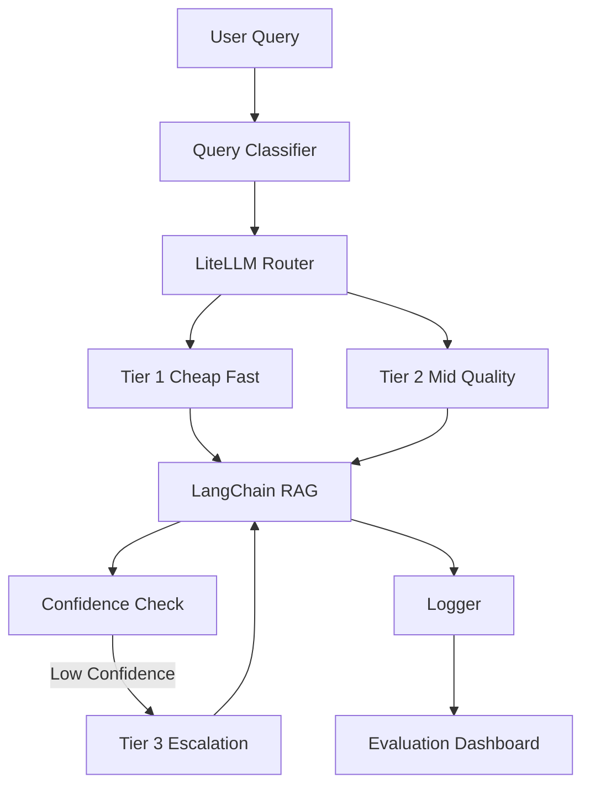

# Implementation Guide: Multi-Model Cost and Quality Router for RAG

## 1) Objective

Build a production-style RAG system that minimizes spend while preserving answer quality by routing each query to the least expensive capable model.

## 2) High-Level Architecture



## 3) Component Breakdown

### 3.1 Corpus and Ingestion

- Corpus location: `data/corpus`
- Ingestion pipeline:
  1. Load local `.md` and `.txt` files.
  2. Split with `RecursiveCharacterTextSplitter`.
  3. Embed chunks with `sentence-transformers/all-MiniLM-L6-v2`.
  4. Persist vectors in local Chroma store (`vectorstore/`).

### 3.2 Query Classifier

- File: `src/router/classifier.py`
- Strategy: prompt-based LLM classifier on cheap model.
- Output schema:
  - `label` in `{simple, complex, ambiguous}`
  - `confidence` in `[0, 1]`
  - `rationale`
- Resilience: falls back to keyword heuristic if parsing/call fails.

### 3.3 Multi-Model Routing and Fallback

- File: `src/router/model_router.py`
- Tier mapping:
  - simple -> tier_1
  - complex -> tier_2
  - ambiguous -> tier_2
- Each tier has ordered model list (`.env` driven).
- LiteLLM receives primary model plus same-tier fallbacks.
- Domain presets (support/devdocs/compliance) modify routing and escalation policy.

### 3.3.1 Domain Policy Presets

- File: `src/router/domain_policy.py`
- Presets:
  - `support`
  - `devdocs`
  - `compliance`
- Responsibilities:
  1. choose initial tier based on query and classifier output
  2. set tier-specific confidence acceptance thresholds
  3. enforce source-count requirements for stricter domains
  4. provide KPI target bands for dashboard evaluation

### 3.4 Confidence and Escalation

- Files:
  - `src/router/confidence.py`
  - `src/router/model_router.py`
- Confidence score combines:
  - model self-reported confidence
  - heuristic confidence from answer quality signals
- Final score:

$$
\text{final} = 0.7 \cdot \text{model\_confidence} + 0.3 \cdot \text{heuristic\_confidence}
$$

- If final confidence < threshold, pipeline escalates to tier_3 and can replace prior answer if stronger response is more confident.

### 3.5 LangChain RAG Pipeline

- File: `src/pipeline/rag_pipeline.py`
- Steps:
  1. Resolve active domain preset from `--domain` or config default.
  2. Classify query.
  3. Retrieve top-k chunks from Chroma.
  4. Format context with source tags.
  5. Route by domain policy and generate answer.
  6. Apply domain-aware escalation checks.
  7. Log end-to-end metadata, including `domain` and `route_reason`.

### 3.6 Logging

- File: `src/utils/logger.py`
- Per-query JSONL record includes:
  - scenario
  - classification + rationale
  - model and tier
  - latency and cost
  - final confidence
  - escalation flag
  - semantic cache hit metadata
  - domain preset and route reason
  - source count
  - retrieved sources

### 3.7 Semantic Cache

- File: `src/cache/semantic_cache.py`
- Strategy:
  1. Embed incoming query.
  2. Compare cosine similarity against cached query embeddings.
  3. If nearest similarity >= threshold, return cached answer with zero LLM cost.
  4. For cache miss, run normal pipeline and store high-confidence answers.
- Default behavior:
  - enabled for interactive queries
  - disabled for eval scenarios by default for fair benchmarking

### 3.8 Evaluation

- File: `src/evaluation/evaluator.py`
- Input set: `data/eval/eval_set.csv` (30 queries).
- Scenarios:
  - `cheap_only` (forced tier_1)
  - `expensive_only` (forced tier_3)
  - `router` (dynamic tier + escalation)
- Domain-aware evaluation:
  - pass `--domain` to evaluate a specific preset policy
  - outputs include `domain`, `route_reason`, and `source_count`
- Accuracy proxy: RapidFuzz token-set similarity against ground truth.
- Artifacts:
  - `logs/eval_results.csv`
  - `logs/eval_summary.json`

### 3.9 Threshold Sweep Experiments

- File: `src/evaluation/threshold_sweep.py`
- Purpose: map confidence threshold to cost/accuracy outcomes.
- For each threshold in a grid:
  1. run full three-scenario evaluation
  2. save per-threshold artifacts under `logs/sweeps/`
  3. aggregate router metrics into `logs/threshold_sweep.csv`
- Summary output:
  - `logs/threshold_sweep_summary.json`
  - includes best threshold by highest accuracy, then lowest cost

### 3.10 Dashboard

- File: `dashboard/app.py`
- Visuals:
  - domain selector
  - domain KPI target panel (`pass` / `watch` status)
  - cost vs accuracy scatter (scenario frontier)
  - threshold sweep trend chart
  - semantic cache hit-rate metric
  - per-query routing table
  - live query logs
  - top-line metrics (accuracy, total cost, savings)

## 4) Configuration

Use `.env` to configure model tiers and routing policy:

- `CLASSIFIER_MODEL`
- `ROUTER_DOMAIN`
- `TIER_1_MODELS`
- `TIER_2_MODELS`
- `TIER_3_MODELS`
- `CONFIDENCE_THRESHOLD`
- `RETRIEVAL_TOP_K`
- `CHUNK_SIZE`
- `CHUNK_OVERLAP`
- `ENABLE_SEMANTIC_CACHE`
- `SEMANTIC_CACHE_SIMILARITY_THRESHOLD`
- `SEMANTIC_CACHE_MAX_ENTRIES`
- `SEMANTIC_CACHE_MIN_CONFIDENCE`

This lets you test many strategy variants without code changes.

## 5) End-to-End Runbook

1. Install dependencies.
2. Provide API keys in `.env`.
3. Run ingestion:

   ```bash
   python -m src.main ingest
   ```

4. Test interactive query:

   ```bash
   python -m src.main ask --query "How do I safely retry charges during rate limits?"
   ```

  Domain-specific examples:

  ```bash
  python -m src.main ask --domain support --query "How can I retry a timed-out charge safely?"
  python -m src.main ask --domain devdocs --query "What is the max list endpoint limit?"
  python -m src.main ask --domain compliance --query "What controls are needed for webhook replay protection?"
  ```

5. Run evaluations:

   ```bash
   python -m src.main eval
   ```

  Domain-specific example:

  ```bash
  python -m src.main eval --domain devdocs
  ```

6. Run threshold sweep:

  ```bash
  python -m src.main sweep --domain support --start-threshold 0.60 --end-threshold 0.90 --step 0.05
  ```

7. One-click full pipeline:

  ```powershell
  scripts\run_all.ps1 -Domain support
  ```

8. Open dashboard:

   ```bash
   streamlit run dashboard/app.py
   ```

9. Optional one-click launcher from Explorer:

  ```bat
  scripts\run_all.bat
  ```

## 6) How to Explain This in Interviews

1. You operationalized LLM economics with measurable routing policy.
2. You built for failure modes (fallbacks and escalation).
3. You used eval-driven development, not ad-hoc testing.
4. You can discuss policy tuning:
   - lower threshold for more savings
   - higher threshold for stronger quality
5. You can explain domain policy differentiation and governance:
  - support optimizes cost and speed with selective high-risk escalation
  - devdocs optimizes factual precision and debugging depth
  - compliance prioritizes correctness and traceability over cost

## 7) Suggested Experiments

1. Sweep confidence threshold from 0.60 to 0.90 and re-run eval.
2. Compare alternative tier_1 open-source models for lower cost.
3. Add a semantic cache and track cache-hit savings.
4. Add a secondary topic classifier and route by both complexity and domain.

## 8) Production Notes

- Add structured tracing to LangSmith or OpenTelemetry.
- Add guardrails for prompt injection and retrieval poisoning.
- Replace heuristic scoring with LLM-as-judge or human labels.
- Add batch evaluation in CI to prevent routing regressions.
